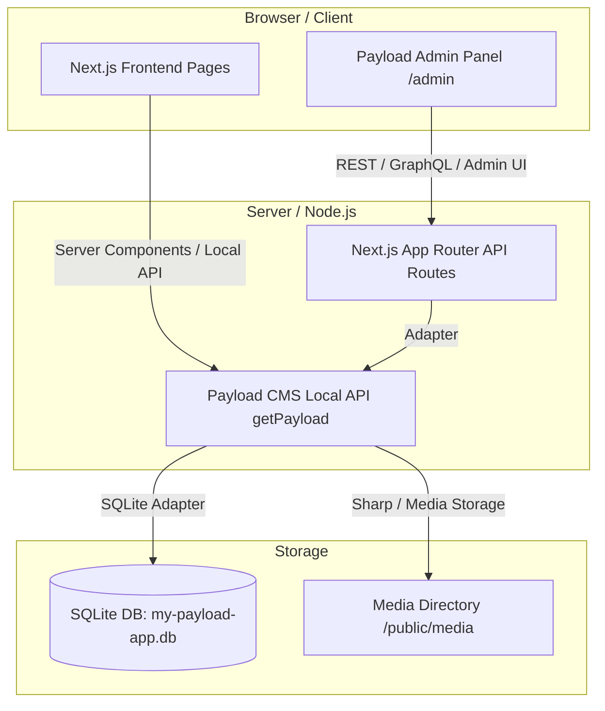

# 📚 Novel Signature Homes - Developer Knowledge Transfer (KT) Guide
> **Project:** `my-payload-app`  
> **Tech Stack:** Next.js 16 (App Router) + Payload CMS 3.86 (Embedded) + SQLite (`my-payload-app.db`) + Lexical Editor + TailwindCSS + Vitest + Playwright  

---

## 📑 Table of Contents
1. [Architecture Overview](#1-architecture-overview)
2. [Complete Directory & File Structure (Folder Uses & Roles)](#2-complete-directory--file-structure)
3. [Step-by-Step Development Lifecycle (Step 0 to Testing)](#3-step-by-step-development-lifecycle)
   - [Step 1: Define Admin Schema (Adding Fields/Blocks)](#step-1-define-admin-schema-adding-fieldsblocks)
   - [Step 2: Generate Types & Import Map](#step-2-generate-types--import-map)
   - [Step 3: Update SQLite Database Schema (Migration Scripts)](#step-3-update-sqlite-database-schema-migration-scripts)
   - [Step 4: Fetch & Render Data on Next.js Frontend](#step-4-fetch--render-data-on-nextjs-frontend)
   - [Step 5: Live Preview & Admin Bar Setup](#step-5-live-preview--admin-bar-setup)
   - [Step 6: Automated Testing (Vitest & Playwright)](#step-6-automated-testing-vitest--playwright)
4. [Database & Seeding Utilities Reference](#4-database--seeding-utilities-reference)
5. [Troubleshooting & FAQs](#5-troubleshooting--faqs)

---

## 1. Architecture Overview

This project uses an **embedded Payload CMS 3.x architecture** integrated directly into Next.js 16 App Router.



### Core Architecture Highlights
- **Embedded Payload CMS**: Payload runs inside Next.js at `src/app/(payload)/` without requiring a separate backend process.
- **Payload Local API**: Queries CMS data directly in Next.js Server Components via `getPayload({ config })` with zero HTTP request overhead.
- **Database**: SQLite database stored in the root file `my-payload-app.db`.
- **Rich Text**: `@payloadcms/richtext-lexical` for structured content editing.

---

## 2. Complete Directory & File Structure

Here is the exact file & folder breakdown of the codebase, detailing **what each directory stores** and **how it is used**:

```
my-payload-app/
├── .env                              # Local environment variables (DATABASE_URL, PAYLOAD_SECRET)
├── .env.example                      # Template for required environment variables
├── Dockerfile                        # Containerization setup for production deployments
├── docker-compose.yml                # Docker Compose config for local or staging execution
├── my-payload-app.db                 # SQLite database file containing all CMS data & entries
├── next.config.ts                    # Next.js configuration (images, redirects, headers)
├── next-sitemap.config.cjs           # Sitemap generator configuration
├── package.json                      # NPM dependencies, scripts, and package metadata
├── payload.db                        # Secondary/fallback payload database file
├── playwright.config.ts              # End-to-End testing configuration (Playwright)
├── tailwind.config.mjs               # Tailwind CSS theme, colors, font styling rules
├── tsconfig.json                     # TypeScript compiler settings & path aliases (@/* -> ./src/*)
├── vitest.config.mts                 # Integration unit test runner configuration (Vitest)
│
├── public/                           # Static public assets (images, icons, favicons, media)
│   ├── favicon.ico                   # Browser favicon icon
│   └── media/                        # User-uploaded media files from Payload CMS
│
├── tests/                            # Test suites directory
│   ├── e2e/                          # End-to-End browser tests (Playwright)
│   │   ├── admin.e2e.spec.ts         # Verifies Admin Dashboard login and collection navigation
│   │   └── frontend.e2e.spec.ts      # Verifies frontend home page rendering and route loads
│   ├── helpers/                      # Test helper utilities
│   │   ├── login.ts                  # Automated Playwright login helper function
│   │   └── seedUser.ts               # Test user creation & cleanup for test isolated runs
│   └── int/                          # Backend API integration tests (Vitest)
│       └── api.int.spec.ts           # Integration tests testing getPayload Local API
│
└── src/                              # Main application source code directory
    ├── payload.config.ts             # Central Payload CMS configuration file
    ├── payload-types.ts              # Auto-generated TypeScript definitions for CMS collections
    ├── environment.d.ts              # Environment variable type declarations
    ├── cssVariables.js               # Exported CSS layout variables
    │
    ├── access/                       # Payload CMS Access Control functions
    │   ├── authenticated.ts          # Restricts operations to logged-in users
    │   └── authenticatedOrPublished.ts# Allows public read if published, requires auth for draft
    │
    ├── app/                          # Next.js App Router pages and API routes
    │   ├── (frontend)/               # Customer-facing website routes
    │   │   ├── layout.tsx            # Main website root layout (Providers, Header, Footer)
    │   │   ├── page.tsx              # Homepage router & renderer
    │   │   ├── globals.css           # Global Tailwind & CSS custom properties
    │   │   ├── about/                # About Us page route
    │   │   ├── blogs/                # Blog listing and category routes
    │   │   ├── concierge/            # Concierge services landing page
    │   │   ├── contact/              # Contact form & location page
    │   │   ├── posts/                # Post detail page routes ([slug])
    │   │   ├── privacy-policy/       # Privacy policy page
    │   │   ├── properties/           # Property listings & detail page routes ([slug])
    │   │   ├── search/               # Search result page route
    │   │   ├── terms-and-conditions/ # Terms & Conditions page
    │   │   └── thank-you/            # Form submission thank you page
    │   │
    │   └── (payload)/                # Embedded Payload CMS Admin Panel routes
    │       ├── admin/                # Admin Panel UI routes (/admin)
    │       └── api/                  # Payload REST/GraphQL API endpoints (/api)
    │
    ├── blocks/                       # Reusable Page Layout Blocks (CMS Dynamic Content)
    │   ├── RenderBlocks.tsx          # Master block switcher component rendering dynamic blocks
    │   ├── ArchiveBlock/             # Renders collection list/archives (Blogs, Properties)
    │   ├── Banner/                   # Alert banners & callout blocks
    │   ├── CallToAction/             # CTA banners with buttons and background images
    │   ├── Carousel/                 # Image slider / testimonial carousel block
    │   ├── Code/                     # Syntax-highlighted code block renderer
    │   ├── Content/                  # Multi-column rich text layout block
    │   ├── Form/                     # Form Builder block integration (Contact forms)
    │   ├── InquiryHero/              # Custom hero banner for inquiry forms
    │   ├── MediaBlock/               # Full-width or inline single media display block
    │   └── RelatedPosts/             # Related blogs/properties grid block
    │
    ├── collections/                  # Payload CMS Collection Configurations (Database Tables)
    │   ├── Blogs/                    # Blogs collection config & hooks
    │   ├── Pages/                    # Dynamic Pages collection config & hooks
    │   ├── Posts/                    # News & Updates posts collection config
    │   ├── Users/                    # Admin users, permissions & login config
    │   ├── Categories.ts             # Blog & Property categories taxonomy collection
    │   ├── CF7Tracker.ts             # Form lead submission tracker collection
    │   ├── Media.ts                  # Upload collection config (Image size resizing rules)
    │   └── Properties.ts             # Real estate property listings collection config
    │
    ├── components/                   # Shared React UI Components
    │   ├── ui/                       # Low-level UI primitives (Button, Input, Select, Dialog)
    │   ├── AdminBar/                 # Top admin bar visible for logged-in admins on frontend
    │   ├── BeforeDashboard/          # Custom component rendered above Admin Dashboard
    │   ├── BeforeLogin/              # Custom component rendered on Admin Login screen
    │   ├── Card/                     # Property & Blog post card component
    │   ├── CollectionArchive/        # Paginated grid layout for posts and properties
    │   ├── FloatingContactWidget/    # Floating action bar for quick phone/WhatsApp contact
    │   ├── LivePreviewListener/      # React listener syncing CMS Live Preview iframe
    │   ├── Logo/                     # Novel Signature Homes SVG brand logo
    │   ├── Media/                    # Optimized image wrapper for Payload media objects
    │   ├── NSHHomePage/              # Custom homepage visual layout component
    │   ├── Pagination/               # Reusable pagination controls component
    │   └── RichText/                 # Lexical Rich Text JSON renderer component
    │
    ├── fields/                       # Reusable Custom CMS Field Definitions
    │   ├── defaultLexical.ts         # Default Lexical rich text editor configuration
    │   ├── link.ts                   # Link selector field (Internal CMS link vs custom URL)
    │   ├── linkGroup.ts              # Array of link fields (Navigation menus, footer links)
    │   └── seo.ts                    # SEO meta title, description, and image field group
    │
    ├── globals/                      # Global Single-Instance CMS Configurations
    │   ├── Header/                   # Header navigation menu configuration & component
    │   ├── Footer/                   # Footer layout, copyright, and link configuration
    │   └── Settings.ts               # Global site settings (Site title, branding, social links)
    │
    ├── heros/                        # Hero Header Section Renderers
    │   ├── HighImpact/               # Full-screen hero section renderer
    │   ├── MediumImpact/             # Sub-page banner hero section renderer
    │   ├── LowImpact/                # Simple title-only banner hero section renderer
    │   └── RenderHero.tsx            # Router component rendering selected Hero type
    │
    ├── hooks/                        # Custom React and Payload CMS Hooks
    │   ├── populateArchiveBlock.ts   # Auto-populates archive blocks with latest records
    │   └── revalidatePath.ts         # Triggers Next.js ISR cache revalidation on document save
    │
    ├── plugins/                      # Payload CMS Plugin Integrations
    │   └── index.ts                  # Configures SEO, FormBuilder, Redirects, NestedDocs plugins
    │
    ├── providers/                    # React Context State Providers
    │   ├── HeaderTheme/              # Manages header theme state (Dark vs Light overlay)
    │   └── Theme/                    # Site color mode provider (Light / Dark theme)
    │
    ├── scripts/                      # Database Maintenance, Migrations & Seeding Scripts
    │   ├── add-additional-content-db-columns.ts # Adds extra SQLite columns for Page content
    │   ├── createTestUsers.ts        # Programmatically creates admin user for testing
    │   ├── cleanSlate.ts             # Resets database tables for clean testing environment
    │   ├── populate-all-pages.ts     # Populates initial default page content into CMS
    │   ├── seedDemoBlogs.ts          # Populates demo blog posts with content & categories
    │   └── seedDemoProperty.ts       # Populates initial real estate property listings
    │
    └── utilities/                    # Server & Client Helper Utility Functions
        ├── generateMeta.ts           # Generates HTML OpenGraph meta tags from SEO fields
        ├── getDocument.ts            # Helper function fetching single doc by slug
        ├── getGlobals.ts             # Helper function fetching Global configs (Header/Footer)
        ├── getMediaUrl.ts            # Resolves absolute URL path for uploaded images
        └── getURL.ts                 # Formats server environment base URLs
```

---

## 3. Step-by-Step Development Lifecycle

Below is the step-by-step guide for creating a new feature from scratch (e.g. adding a field in admin dashboard to testing).

---

### Step 1: Define Admin Schema (Adding Fields/Blocks)

All CMS schemas live inside `src/collections/` or `src/blocks/`.

#### Real Code Walkthrough: Adding a field to `src/collections/Properties.ts`
Open [src/collections/Properties.ts](file:///home/novel/my-payload-app/src/collections/Properties.ts) and insert your field into the `fields` array:

```typescript
// src/collections/Properties.ts
import type { CollectionConfig } from 'payload'

export const Properties: CollectionConfig = {
  slug: 'properties',
  fields: [
    {
      name: 'title',
      type: 'text',
      required: true,
    },
    // NEW FIELD ADDED HERE:
    {
      name: 'pricePrefix',
      type: 'text',
      label: 'Price Prefix (e.g. "Starting from")',
      admin: {
        placeholder: 'Starting from',
      },
    },
    {
      name: 'amenities',
      type: 'array',
      label: 'Amenities List',
      fields: [
        {
          name: 'feature',
          type: 'text',
          required: true,
        },
      ],
    },
  ],
}
```

---

### Step 2: Generate Types & Import Map

Whenever collection schemas or custom admin components change, run type generation:

```bash
# 1. Update TypeScript interfaces in src/payload-types.ts
pnpm generate:types

# 2. Update Admin component map (if custom admin components were added)
pnpm generate:importmap
```

---

### Step 3: Update SQLite Database Schema (Migration Scripts)

Because Payload SQLite adapter is configured with `push: false` in [src/payload.config.ts](file:///home/novel/my-payload-app/src/payload.config.ts) to prevent accidental data overwrites, new columns must be added to SQLite database file `my-payload-app.db`.

Create a migration script in `src/scripts/` (e.g. `src/scripts/add-property-columns.ts`):

```typescript
// src/scripts/add-property-columns.ts
import Database from 'better-sqlite3'
import path from 'path'

const dbPath = path.resolve(process.cwd(), 'my-payload-app.db')
const db = new Database(dbPath)

try {
  db.exec(`ALTER TABLE properties ADD COLUMN price_prefix TEXT;`)
  console.log('✅ Column price_prefix added successfully!')
} catch (err) {
  console.log('Column may already exist:', err)
}
```

Run the script using `tsx`:
```bash
npx tsx ./src/scripts/add-property-columns.ts
```

---

### Step 4: Fetch & Render Data on Next.js Frontend

Expose the new field inside Next.js Server Component pages (e.g., `src/app/(frontend)/properties/page.tsx`):

```typescript
import { getPayload } from 'payload'
import configPromise from '@/payload.config'

export default async function PropertiesPage() {
  const payload = await getPayload({ config: configPromise })

  const properties = await payload.find({
    collection: 'properties',
    where: { _status: { equals: 'published' } },
  })

  return (
    <div className="container mx-auto py-10">
      <h1 className="text-3xl font-bold mb-6">Properties</h1>
      <div className="grid grid-cols-1 md:grid-cols-3 gap-6">
        {properties.docs.map((property) => (
          <div key={property.id} className="border p-4 rounded-xl shadow-sm">
            <h2 className="text-xl font-bold">{property.title}</h2>
            {property.pricePrefix && (
              <span className="text-sm text-gray-500">{property.pricePrefix} </span>
            )}
            <p className="text-lg font-semibold text-emerald-600">${property.price}</p>
          </div>
        ))}
      </div>
    </div>
  )
}
```

---

### Step 5: Live Preview & Admin Bar Setup

When editing content in `/admin`, Payload renders live preview via iframe.

Client side hook usage in React components (`src/app/(frontend)/properties/[slug]/PropertyDetailClient.tsx`):
```typescript
'use client'
import { useLivePreview } from '@payloadcms/live-preview-react'

export function PropertyDetailClient({ initialData }) {
  const { data } = useLivePreview({
    initialData,
    serverURL: process.env.NEXT_PUBLIC_SERVER_URL || '',
    depth: 2,
  })

  return <h1>{data.title}</h1>
}
```

---

### Step 6: Automated Testing (Vitest & Playwright)

#### 1. Integration Tests (Vitest)
File: `tests/int/api.int.spec.ts`

```typescript
import { getPayload } from 'payload'
import config from '@/payload.config'
import { describe, it, expect, beforeAll } from 'vitest'

describe('Properties API', () => {
  let payload

  beforeAll(async () => {
    payload = await getPayload({ config: await config })
  })

  it('queries published properties', async () => {
    const res = await payload.find({ collection: 'properties' })
    expect(res.docs).toBeDefined()
  })
})
```
Run Integration Tests:
```bash
pnpm test:int
```

#### 2. End-to-End Tests (Playwright)
File: `tests/e2e/admin.e2e.spec.ts`

```typescript
import { test, expect } from '@playwright/test'
import { login } from '../helpers/login'
import { testUser } from '../helpers/seedUser'

test('can navigate to properties edit page', async ({ page }) => {
  await login({ page, user: testUser })
  await page.goto('http://localhost:3000/admin/collections/properties/create')
  await expect(page.locator('input[name="title"]')).toBeVisible()
})
```
Run E2E Tests:
```bash
pnpm test:e2e
```

Run All Tests:
```bash
pnpm test
```

---

## 4. Database & Seeding Utilities Reference

| NPM Command / Terminal Script | Script Location | Function / Purpose |
| :--- | :--- | :--- |
| `pnpm seed:blogs` | `src/scripts/seedDemoBlogs.ts` | Seeds demo blog posts with categories |
| `npx tsx ./src/scripts/seedDemoProperty.ts` | `src/scripts/seedDemoProperty.ts` | Seeds property listings data |
| `npx tsx ./src/scripts/createTestUsers.ts` | `src/scripts/createTestUsers.ts` | Creates initial test admin credentials |
| `npx tsx ./src/scripts/cleanSlate.ts` | `src/scripts/cleanSlate.ts` | Resets CMS database tables |
| `npx tsx ./src/scripts/populate-all-pages.ts` | `src/scripts/populate-all-pages.ts` | Populates default website pages (Home, About, Privacy, etc.) |

---

## 5. Troubleshooting & FAQs

### ⚠️ Common Errors & Fixes

1. **`Property X does not exist on type Page/Property`**
   - **Fix**: Run `pnpm generate:types`.

2. **SQLite Error: `no such column: column_name`**
   - **Fix**: Execute column migration script in `src/scripts/` to add column to `my-payload-app.db`.

3. **Admin Panel components fail to load**
   - **Fix**: Run `pnpm generate:importmap`.

4. **Port 3000 busy or SQLite locked**
   - **Fix**: Kill node processes with `killall node` or stop existing `pnpm dev` instances.
