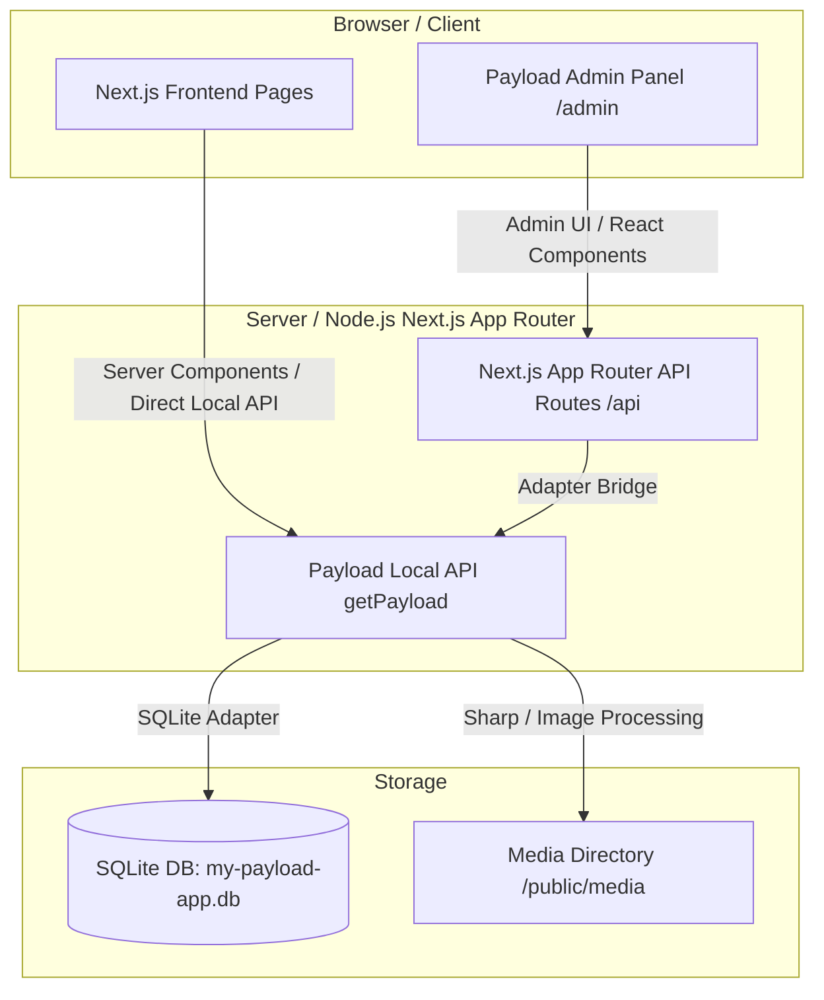

# 📚 Novel Signature Homes - Complete Developer & Beginner's Guide

> **Project:** `my-payload-app` (Novel Signature Homes)  
> **Tech Stack:** Next.js 16 (App Router) + Payload CMS 3.86 (Embedded) + PostgreSQL (`@payloadcms/db-postgres`) & SQLite (`my-payload-app.db`) + Lexical Rich Text Editor + TailwindCSS + Vitest + Playwright  

---

## 📑 Table of Contents
1. [Beginner's Overview: Next.js + Payload CMS 3.x](#1-beginners-overview-nextjs--payload-cms-3x)
2. [Database Architecture & PostgreSQL Benefits](#2-database-architecture--postgresql-benefits)
3. [Architecture Overview](#3-architecture-overview)
4. [Complete Directory & File Structure (Folder Uses & Roles)](#4-complete-directory--file-structure)
5. [Quick Start & Local Setup](#5-quick-start--local-setup)
6. [Step-by-Step Development Lifecycle](#6-step-by-step-development-lifecycle)
7. [Production Deployment & Containerization (Docker & Render.com)](#7-production-deployment--containerization)
8. [Database Maintenance & Seeding Utilities Reference](#8-database-maintenance--seeding-utilities-reference)
9. [Troubleshooting & FAQs](#9-troubleshooting--faqs)
10. [Optional Note: How Images & Dynamic Pages Load Easily on the Live Website](#10-optional-note-how-images--dynamic-pages-load-easily-on-the-live-website)

---

## 1. Beginner's Overview: Next.js + Payload CMS 3.x

If you are new to **Payload CMS** or **Next.js App Router**, this section breaks down the foundational concepts used in this project.

### What is Payload CMS 3.x?
Payload CMS is a headless Content Management System built with TypeScript and Node.js. Unlike traditional CMS platforms (like WordPress or Drupal), Payload 3.x is **embedded directly into Next.js**. It runs natively inside your Next.js application at `src/app/(payload)/` — meaning there is **no separate backend server to deploy**.

### Core Concepts Explained

| Concept | Explanation | Real Example in Project |
| :--- | :--- | :--- |
| **Embedded Architecture** | Payload routes (`/admin` and `/api`) run directly inside Next.js App Router. | `src/app/(payload)/admin` and `src/app/(payload)/api` |
| **Collections** | Database tables representing repeatable content types (e.g. posts, pages, properties). | [src/collections/Properties.ts](file:///home/novel/my-payload-app/src/collections/Properties.ts), [src/collections/Blogs.ts](file:///home/novel/my-payload-app/src/collections/Blogs.ts) |
| **Globals** | Single-instance content types for global site settings (e.g. Header nav, Footer links, Site Title). | [src/globals/Settings.ts](file:///home/novel/my-payload-app/src/globals/Settings.ts), `src/Header/config.ts` |
| **Blocks** | Dynamic visual UI components that content editors can insert, reorder, and configure on any page. | `src/blocks/ArchiveBlock`, `src/blocks/CallToAction`, `src/blocks/Carousel` |
| **Local API (`getPayload`)** | Directly query CMS data inside Next.js Server Components with 0 HTTP latency (bypassing REST/GraphQL). | `const payload = await getPayload({ config }); await payload.find({ collection: 'properties' });` |
| **Lexical Editor** | The default rich text editor in Payload that outputs clean JSON data instead of raw HTML. | Configured via `@payloadcms/richtext-lexical` in [src/fields/defaultLexical.ts](file:///home/novel/my-payload-app/src/fields/defaultLexical.ts) |
| **Dual Database Adapter** | Supports both PostgreSQL (`@payloadcms/db-postgres`) for production and SQLite (`@payloadcms/db-sqlite`) for local dev. | Configured in [src/payload.config.ts](file:///home/novel/my-payload-app/src/payload.config.ts) |

---

## 2. Database Architecture & PostgreSQL Benefits

This project is built with **Smart Dual-Database Support** in [src/payload.config.ts](file:///home/novel/my-payload-app/src/payload.config.ts):

- **Local Development**: Uses `@payloadcms/db-sqlite` with local `my-payload-app.db` file for instant, zero-configuration local dev setup.
- **Production Deployment**: Supports `@payloadcms/db-postgres` for high-performance cloud databases (Render PostgreSQL, Supabase, Neon, AWS RDS).

### ⚡ Key Benefits of PostgreSQL

1. **Permanent Data Persistence**  
   In cloud platforms like Render or AWS, application containers restart dynamically. A local database file inside a container is ephemeral. PostgreSQL operates on dedicated, managed database instances — ensuring your listings, media records, and admin data remain permanently safe and persistent across all container deploys.

2. **High Concurrency & Heavy Traffic Handling**  
   PostgreSQL is designed for production workloads. It efficiently manages concurrent database connections, complex relational joins, full-text searching, and background jobs without locking or bottlenecks.

3. **Automated Cloud Backups & Point-in-Time Recovery**  
   Using PostgreSQL allows you to take advantage of automated daily database snapshots, read replicas, and point-in-time recovery on cloud providers (Supabase, Neon, Render PostgreSQL).

4. **Smart Automatic Switching in `payload.config.ts`**  
   When the `DATABASE_URI` environment variable is set (e.g. on Render), Payload CMS automatically boots with `@payloadcms/db-postgres`. If omitted, it falls back to local SQLite smoothly.

---

## 2. Architecture Overview



### Key Technical Characteristics
- **Zero HTTP Overhead**: Frontend Server Components retrieve database documents using Payload's `Local API` directly within Node.js execution.
- **SQLite Database**: Data is stored in `my-payload-app.db` at the project root, pre-populated with real estate listings, blogs, pages, and categories.
- **Automatic Image Optimization**: Next.js `next/image` is configured with wildcard patterns and `/media/**` paths to deliver high-performance image assets.
- **Fail-Safe Route Guards**: All static dynamic page routes (`/properties/[slug]`, `/posts/[slug]`, etc.) include try-catch error boundaries to handle database initialization seamlessly during cold builds.

---

## 3. Complete Directory & File Structure

Below is the detailed breakdown of the codebase layout:

```
my-payload-app/
├── .env                              # Environment variables (DATABASE_URL, PAYLOAD_SECRET, etc.)
├── .env.example                      # Reference template for required environment variables
├── Dockerfile                        # Docker image setup (Node.js 20 slim base image for production)
├── docker-compose.yml                # Container orchestration configuration
├── my-payload-app.db                 # Primary SQLite database containing pre-populated CMS data
├── next.config.ts                    # Next.js config (Payload wrapper, image hostnames, standalone mode)
├── next-sitemap.config.cjs           # Automated sitemap generation configuration
├── package.json                      # NPM dependencies, scripts, and package metadata
├── payload.db                        # Fallback database file
├── playwright.config.ts              # End-to-End testing configuration (Playwright)
├── tailwind.config.mjs               # Tailwind CSS theme and styling configuration
├── tsconfig.json                     # TypeScript compiler config & path aliases (@/* -> ./src/*)
├── vitest.config.mts                 # Integration test runner configuration (Vitest)
│
├── public/                           # Static static files served directly
│   ├── favicon.ico                   # Website browser icon
│   └── media/                        # User-uploaded images & property media assets
│
├── tests/                            # Test suites directory
│   ├── e2e/                          # End-to-End browser tests (Playwright)
│   │   ├── admin.e2e.spec.ts         # Tests admin login flow & collection navigation
│   │   └── frontend.e2e.spec.ts      # Tests homepage & property detail rendering
│   ├── helpers/                      # Test helper utilities
│   │   ├── login.ts                  # Helper function for automated admin login
│   │   └── seedUser.ts               # Test user creation & cleanup helper
│   └── int/                          # Backend API integration tests (Vitest)
│       └── api.int.spec.ts           # Integration tests for Payload Local API
│
└── src/                              # Main application source code
    ├── payload.config.ts             # Central Payload CMS configuration file
    ├── payload-types.ts              # Auto-generated TypeScript interfaces for CMS schemas
    ├── environment.d.ts              # Custom environment variable type declarations
    ├── cssVariables.js               # Exported layout and spacing CSS variables
    │
    ├── access/                       # Payload CMS Access Control rules
    │   ├── authenticated.ts          # Restricts edit access to logged-in admins
    │   └── authenticatedOrPublished.ts# Allows public read if status is published
    │
    ├── app/                          # Next.js App Router routes
    │   ├── (frontend)/               # Customer-facing website pages
    │   │   ├── layout.tsx            # Main website layout (Header, Footer, Providers)
    │   │   ├── page.tsx              # Homepage route component
    │   │   ├── globals.css           # Global CSS styles & Tailwind directives
    │   │   ├── about/                # About Us page route
    │   │   ├── blogs/                # Blog listings & category filter pages
    │   │   ├── concierge/            # Concierge luxury services page
    │   │   ├── contact/              # Contact form & location details page
    │   │   ├── other-inquiries/      # General inquiry form page
    │   │   ├── posts/                # Blog post detail page routes ([slug])
    │   │   ├── privacy-policy/       # Privacy policy page
    │   │   ├── properties/           # Real estate listing grid & detail pages ([slug])
    │   │   ├── search/               # Search result page route
    │   │   ├── terms-and-conditions/ # Terms & Conditions page
    │   │   └── thank-you/            # Submission confirmation page
    │   │
    │   └── (payload)/                # Embedded Payload CMS routes
    │       ├── admin/                # Admin Panel UI (/admin)
    │       └── api/                  # REST & GraphQL API endpoints (/api)
    │
    ├── blocks/                       # Dynamic Layout Builder Blocks
    │   ├── RenderBlocks.tsx          # Master block switcher rendering array of dynamic blocks
    │   ├── ArchiveBlock/             # Collection archive grid (Blogs / Properties)
    │   ├── Banner/                   # Callout banners and notices
    │   ├── CallToAction/             # CTA banners with buttons and images
    │   ├── Carousel/                 # Testimonial & image slider block
    │   ├── Code/                     # Syntax-highlighted code snippet renderer
    │   ├── Content/                  # Multi-column rich text layout block
    │   ├── Form/                     # Form Builder block integration (Contact forms)
    │   ├── InquiryHero/              # Custom inquiry page header banner
    │   ├── MediaBlock/               # Single image/video display block
    │   └── RelatedPosts/             # Grid block for related articles/properties
    │
    ├── collections/                  # Payload CMS Collection Configurations (DB Tables)
    │   ├── Blogs/                    # Blog collection config & hooks
    │   ├── Pages/                    # Dynamic Pages collection config & hooks
    │   ├── Posts/                    # News & Updates collection config
    │   ├── Users/                    # Admin users & credentials config
    │   ├── Categories.ts             # Taxonomy collection for blogs & properties
    │   ├── CF7Tracker.ts             # Contact Form 7 lead tracker collection
    │   ├── Media.ts                  # Media upload collection config (Image resize rules)
    │   └── Properties.ts             # Luxury real estate property listings collection
    │
    ├── components/                   # Shared React Components
    │   ├── ui/                       # Low-level UI primitives (Button, Input, Select, Dialog)
    │   ├── AdminBar/                 # Top admin bar for logged-in users on frontend
    │   ├── BeforeDashboard/          # Custom admin dashboard banner component
    │   ├── BeforeLogin/              # Custom admin login page component
    │   ├── Card/                     # Property & blog summary card component
    │   ├── CollectionArchive/        # Paginated grid layout for items
    │   ├── FloatingContactWidget/    # Quick call/WhatsApp floating action bar
    │   ├── LivePreviewListener/      # React live preview iframe listener
    │   ├── Logo/                     # Novel Signature Homes brand logo component
    │   ├── Media/                    # Optimized image wrapper component
    │   ├── NSHHomePage/              # Custom visual homepage component
    │   ├── Pagination/               # Reusable pagination controls component
    │   └── RichText/                 # Lexical JSON rich text renderer component
    │
    ├── fields/                       # Reusable Custom CMS Field Definitions
    │   ├── defaultLexical.ts         # Lexical rich text editor config
    │   ├── link.ts                   # Internal CMS link vs external URL selector
    │   ├── linkGroup.ts              # Array of link fields (Navigation menus)
    │   └── seo.ts                    # SEO meta title, description, and preview image group
    │
    ├── globals/                      # Global CMS Configurations
    │   ├── Header/                   # Header navigation config & frontend header component
    │   ├── Footer/                   # Footer links & copyright config
    │   └── Settings.ts               # Global site settings config
    │
    ├── heros/                        # Hero Section Renderer Components
    │   ├── HighImpact/               # Full-screen dynamic hero section
    │   ├── MediumImpact/             # Sub-page hero section banner
    │   ├── LowImpact/                # Minimal text-only hero section
    │   └── RenderHero.tsx            # Hero router component
    │
    ├── hooks/                        # Custom Payload & React Hooks
    │   ├── populateArchiveBlock.ts   # Auto-populates archive blocks with DB entries
    │   └── revalidatePath.ts         # Revalidates Next.js static cache on document edit
    │
    ├── plugins/                      # Payload CMS Plugins Configuration
    │   └── index.ts                  # Configures SEO, FormBuilder, Redirects, NestedDocs plugins
    │
    ├── providers/                    # React Context State Providers
    │   ├── HeaderTheme/              # Controls header overlay theme (Light / Dark)
    │   └── Theme/                    # Site color mode provider
    │
    ├── scripts/                      # Database Maintenance & Utility Scripts
    │   ├── add-additional-content-db-columns.ts # Adds SQLite schema columns for dynamic pages
    │   ├── cleanSlate.ts             # Clears database tables for fresh test runs
    │   ├── createTestUsers.ts        # Creates test admin credentials programmatically
    │   ├── populate-all-pages.ts     # Populates default page content into CMS
    │   ├── seedDemoBlogs.ts          # Seeds demo blog posts and categories
    │   └── seedDemoProperty.ts       # Seeds real estate property listings
    │
    └── utilities/                    # Helper Utility Functions
        ├── generateMeta.ts           # Generates HTML OpenGraph tags from SEO fields
        ├── getDocument.ts            # Fetches single document by slug with error handling
        ├── getGlobals.ts             # Fetches Global site data (Header/Footer/Settings)
        ├── getMediaUrl.ts            # Resolves absolute URL for media uploads
        └── getURL.ts                 # Formats environment base URLs
```

---

## 4. Quick Start & Local Setup

Follow these steps to run the application on your local machine:

### Prerequisites
- **Node.js**: `v18.20.2` or `>=v20.9.0` (Recommended: Node 20 LTS)
- **Package Manager**: `pnpm` (version 9 or 10) or `npm`

### Step 1: Clone & Configure Environment Variables
Copy `.env.example` to create a local `.env` file:

```bash
cp .env.example .env
```

Ensure your `.env` contains the following default configuration:

```ini
# Database Connection (SQLite)
DATABASE_URL=file:./my-payload-app.db
PAYLOAD_DB_PUSH=true

# Secret key for signing Payload JWT tokens
PAYLOAD_SECRET=a-very-secret-key-for-local-development

# Public Server URL
NEXT_PUBLIC_SERVER_URL=http://localhost:3000

# Optional SMTP Email Configuration
SMTP_HOST=sandbox.smtp.mailtrap.io
SMTP_PORT=2525
SMTP_USER=your_smtp_user
SMTP_PASS=your_smtp_password
SMTP_FROM=info@novelsignaturehomes.com
SMTP_FROM_NAME=Novel Signature Homes
```

### Step 2: Install Dependencies & Run Development Server

```bash
# Install packages
pnpm install

# Start development server
pnpm dev
```

### Step 3: Access Admin Dashboard & Frontend

- **Frontend Website**: Open [http://localhost:3000](http://localhost:3000)
- **Payload Admin Panel**: Open [http://localhost:3000/admin](http://localhost:3000/admin)

> **Note**: On your first visit to `/admin`, Payload will prompt you to create your initial administrator account. Alternatively, pre-populated data is already stored inside `my-payload-app.db`.

---

## 5. Step-by-Step Development Lifecycle

Here is a practical, step-by-step walkthrough for adding a new field or feature to the project.

---

### Step 1: Define Admin Schema (Collections & Blocks)

CMS schemas live in `src/collections/` or `src/blocks/`.

#### Example: Adding a `locationSummary` field to [src/collections/Properties.ts](file:///home/novel/my-payload-app/src/collections/Properties.ts)

Open `src/collections/Properties.ts` and add your field into the `fields` array:

```typescript
// src/collections/Properties.ts
import type { CollectionConfig } from 'payload'

export const Properties: CollectionConfig = {
  slug: 'properties',
  fields: [
    {
      name: 'title',
      type: 'text',
      required: true,
    },
    // NEW FIELD ADDITION:
    {
      name: 'locationSummary',
      type: 'text',
      label: 'Location Summary (e.g. "Palm Jumeirah, Dubai")',
      admin: {
        placeholder: 'Enter location neighborhood...',
      },
    },
    {
      name: 'price',
      type: 'number',
      required: true,
    },
  ],
}
```

---

### Step 2: Generate Types & Import Map

Whenever you modify Payload collections, blocks, or custom admin components, run type generation:

```bash
# 1. Update TypeScript interfaces in src/payload-types.ts
pnpm generate:types

# 2. Update Payload Admin Component Map
pnpm generate:importmap
```

This guarantees full TypeScript autocompletion across your Next.js pages and prevents Admin Panel compilation errors.

---

### Step 3: Update Database Schema (SQLite Migrations & Auto-Push)

In local development, `PAYLOAD_DB_PUSH=true` automatically syncs missing columns to `my-payload-app.db` when the server starts.

If you ever need to manually execute SQLite column updates, create a quick tsx script in `src/scripts/` (e.g. `src/scripts/add-location-column.ts`):

```typescript
// src/scripts/add-location-column.ts
import Database from 'better-sqlite3'
import path from 'path'

const dbPath = path.resolve(process.cwd(), 'my-payload-app.db')
const db = new Database(dbPath)

try {
  db.exec(`ALTER TABLE properties ADD COLUMN location_summary TEXT;`)
  console.log('✅ Column location_summary successfully added to SQLite!')
} catch (err) {
  console.log('Notice: Column may already exist or table was auto-updated:', err)
}
```

Execute script:
```bash
npx tsx ./src/scripts/add-location-column.ts
```

---

### Step 4: Fetch & Render Data on Next.js Frontend

Display your newly added CMS field in a Next.js Server Component page (e.g. `src/app/(frontend)/properties/page.tsx`):

```tsx
import { getPayload } from 'payload'
import configPromise from '@/payload.config'

export default async function PropertiesPage() {
  // Query Payload CMS directly via Local API
  const payload = await getPayload({ config: configPromise })

  const properties = await payload.find({
    collection: 'properties',
    where: { _status: { equals: 'published' } },
  })

  return (
    <main className="container mx-auto py-10">
      <h1 className="text-3xl font-bold mb-6">Exclusive Properties</h1>
      <div className="grid grid-cols-1 md:grid-cols-3 gap-6">
        {properties.docs.map((property) => (
          <div key={property.id} className="border rounded-xl p-5 shadow-sm">
            <h2 className="text-xl font-bold">{property.title}</h2>
            {property.locationSummary && (
              <p className="text-sm text-gray-500 mb-2">{property.locationSummary}</p>
            )}
            <p className="text-emerald-600 font-bold">${property.price.toLocaleString()}</p>
          </div>
        ))}
      </div>
    </main>
  )
}
```

---

### Step 5: Live Preview & Admin Bar Setup

Payload includes real-time live preview editing directly in the admin panel iframe.

To enable live preview updates inside client components, use the `@payloadcms/live-preview-react` hook:

```tsx
'use client'
import { useLivePreview } from '@payloadcms/live-preview-react'

export function PropertyDetailClient({ initialData }) {
  const { data } = useLivePreview({
    initialData,
    serverURL: process.env.NEXT_PUBLIC_SERVER_URL || '',
    depth: 2,
  })

  return <h1>{data.title}</h1>
}
```

---

### Step 6: Automated Testing (Vitest & Playwright)

This repository includes both unit/integration tests and browser End-to-End tests.

#### 1. Integration Tests (Vitest)
Integration tests verify Payload Local API methods and configuration integrity.  
Test File: `tests/int/api.int.spec.ts`

Run Integration Tests:
```bash
pnpm test:int
```

#### 2. End-to-End Browser Tests (Playwright)
Playwright launches automated browser runs testing admin login and frontend user routes.  
Test Files: `tests/e2e/admin.e2e.spec.ts`, `tests/e2e/frontend.e2e.spec.ts`

Run E2E Tests:
```bash
pnpm test:e2e
```

#### Run All Test Suites:
```bash
pnpm test
```

---

## 6. Production Deployment & Containerization

### Docker Build & Standalone Output
This project is configured with Next.js `output: 'standalone'` and a multi-stage Docker build utilizing `node:20-slim`.

#### Build Docker Image Locally:
```bash
docker build -t my-payload-app .
```

#### Run Docker Container:
```bash
docker run -p 3000:3000 \
  -e PAYLOAD_SECRET="your-production-secret-key" \
  -e DATABASE_URL="file:./my-payload-app.db" \
  my-payload-app
```

### Deploying to Cloud Platforms (Render.com, Vercel, VPS)

1. **Environment Variables on Cloud Provider**:
   - `PAYLOAD_SECRET`: Set a secure secret key string.
   - `DATABASE_URL`: `file:./my-payload-app.db` (or remote PostgreSQL URI if using `@payloadcms/db-postgres`).
   - `PAYLOAD_DB_PUSH`: `false` (in production).
   - `NEXT_PUBLIC_SERVER_URL`: Your live domain (e.g. `https://your-domain.onrender.com`).

2. **Pre-populated Database & Media**:
   - `my-payload-app.db` and `/public/media` are bundled in Git, ensuring zero-configuration startup upon initial cloud deployment.

---

## 7. Database Maintenance & Seeding Utilities Reference

The table below lists all built-in npm and tsx utility scripts for database seeding, user creation, and table maintenance:

| Script / Command | File Location | Purpose & Description |
| :--- | :--- | :--- |
| `pnpm seed:blogs` | `src/scripts/seedDemoBlogs.ts` | Populates demo blog posts and categories |
| `npx tsx ./src/scripts/seedDemoProperty.ts` | `src/scripts/seedDemoProperty.ts` | Populates real estate property listings data |
| `npx tsx ./src/scripts/createTestUsers.ts` | `src/scripts/createTestUsers.ts` | Creates initial test admin account credentials |
| `npx tsx ./src/scripts/cleanSlate.ts` | `src/scripts/cleanSlate.ts` | Resets CMS database tables for clean testing |
| `npx tsx ./src/scripts/populate-all-pages.ts` | `src/scripts/populate-all-pages.ts` | Populates default website static pages (Home, About, Privacy, etc.) |
| `npx tsx ./src/scripts/add-additional-content-db-columns.ts` | `src/scripts/add-additional-content-db-columns.ts` | Adds extra SQLite schema columns for dynamic page block layouts |

---

## 8. Troubleshooting & FAQs

### ⚠️ Common Issues & Recommended Fixes

1. **TypeScript Error: `Property X does not exist on type Page/Property`**
   - **Cause**: The collection schema was modified, but TypeScript types have not been regenerated.
   - **Fix**: Run `pnpm generate:types`.

2. **SQLite Error: `no such column: column_name`**
   - **Cause**: A new field was added to a collection, but SQLite table schema doesn't have the column.
   - **Fix**: Ensure `.env` has `PAYLOAD_DB_PUSH=true` during dev server startup, or run the corresponding migration script in `src/scripts/`.

3. **Admin Panel components fail to load or show import errors**
   - **Cause**: Admin component mapping is out of date.
   - **Fix**: Run `pnpm generate:importmap`.

4. **Port 3000 is busy or SQLite database is locked**
   - **Cause**: An existing `pnpm dev` process is still running in the background.
   - **Fix**: Terminate Node processes with `killall node` or stop conflicting terminal windows.

5. **Images fail to render or return 404**
   - **Cause**: Image path mismatch or missing `next.config.ts` hostname pattern.
   - **Fix**: Check `next.config.ts` for `/media/**` pattern or verify file presence in `public/media/`.

---

## 9. 💡 Optional Note: How Images & Dynamic Pages Load Easily on the Live Website

> [!NOTE]
> This section is an optional architectural note explaining how dynamic content rendering and image asset serving work seamlessly on the live production website (e.g. deployed on Render.com or custom servers).

### 🖼️ 1. How Images Load Easily & Fast on the Live Site
* **Bundled Media Assets (`/public/media`)**:
  All property images, logos, and uploaded media are stored in the `/public/media` directory. In Docker and Render deployments, this directory is included directly in the Git repository and built into the deployment container, ensuring zero broken image links upon initial launch.
* **Next.js Image Optimization (`next.config.ts`)**:
  Next.js `images` configuration is set up with `localPatterns` (`/media/**`, `/api/media/file/**`) and wildcard `remotePatterns` (`protocol: 'https', hostname: '**'`). This enables the Next.js `<Image />` component to automatically resize, compress, convert images to modern WebP/AVIF formats, and cache them for maximum page speed.
* **Sharp Integration**:
  Payload CMS incorporates `sharp` natively to generate responsive focal points, cropped variants, and thumbnails upon image upload in `/admin`.

### ⚡ 2. How Dynamic Pages Load Smoothly without Errors or 404s
* **Real-time Server Rendering (`export const dynamic = 'force-dynamic'`)**:
  Configured on dynamic routes (`/properties/[slug]`, `/blogs/[slug]`, `/posts/[slug]`, `/[slug]`). Whenever a visitor loads a page, Next.js queries SQLite via Payload's Local API on the server in real-time. Any edits made in `/admin` reflect instantly without requiring a site rebuild or redeployment.
* **Instant Support for New Content (`export const dynamicParams = true`)**:
  Guarantees that when a brand new property or blog post is published in Payload Admin, its URL works **immediately**. If a visitor loads a newly created URL (e.g. `/properties/brand-new-villa`), Next.js dynamically fetches and renders it on-demand instead of throwing a `404 Not Found` error.
* **Fail-Safe Route Guards**:
  All dynamic pages feature try/catch error boundaries. If a database query fails or a document is missing, it falls back gracefully or renders `notFound()`, keeping the live site robust and crash-free.

---

## 🤝 Questions & Resources

- [Payload CMS Official Documentation](https://payloadcms.com/docs)
- [Next.js App Router Documentation](https://nextjs.org/docs/app)
- [Payload CMS Discord Community](https://discord.com/invite/payload)
